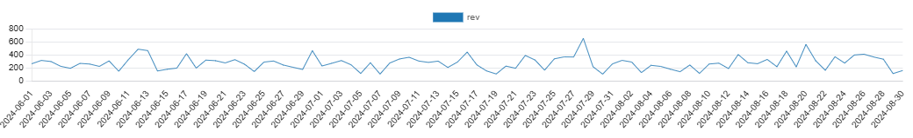

# 🛒 Retail Mini-Mart — SQL Portfolio 


Proyek SQL ringkas yang menunjukkan **schema rapi**, **query analitik nyata**, dan **window functions** di mini toko retail. Dibangun dengan **PostgreSQL + pgAdmin 4**. 

---

## ✨ Highlights
- **Schema**: `customers, products, orders, order_items, payments` (+ view reusable `vw_order_totals`).
- **Analytics**: Top-N products, daily revenue, AOV, RFM mini, Pareto 80/20, unpaid orders, running total, product pairs.
- **Skills**: JOIN, GROUP BY/HAVING, **Window Functions**, Views, data quality checks.
- **Data Volume**: Seed kecil + generator hingga **≥ 1000 orders**.

---

## 🧱 ERD (Mermaid)
> GitHub otomatis merender Mermaid.
```mermaid
erDiagram
  customers ||--o{ orders : places
  orders ||--o{ order_items : contains
  products ||--o{ order_items : referenced
  orders ||--o{ payments : settles

  customers {
    int customer_id PK
    text full_name
    text city
    date join_date
  }

  products {
    int product_id PK
    text product_name
    text category
    numeric price
  }

  orders {
    int order_id PK
    int customer_id FK
    date order_date
    text status
  }

  order_items {
    int order_id FK
    int product_id FK
    int qty
    numeric unit_price
  }

  payments {
    int payment_id PK
    int order_id FK
    text method
    numeric amount
    timestamp paid_at
  }

Daily Revenue:




AOV:


RFM:


Pareto 80/20:


Unpaid Orders:


