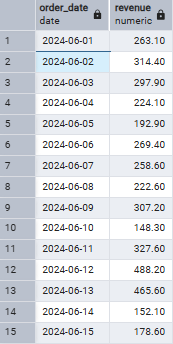
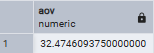
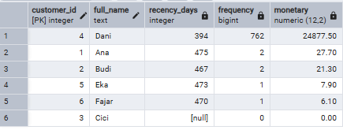
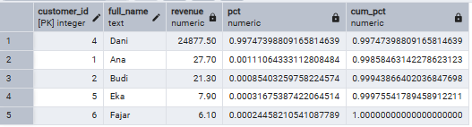
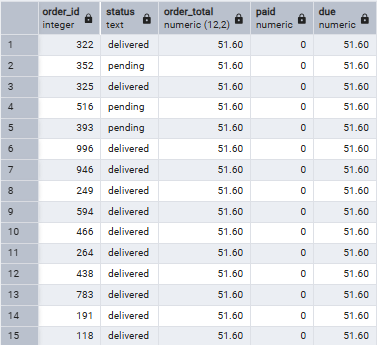

# 🛒 Retail Mini-Mart — SQL Portfolio 


Proyek SQL ringkas yang menunjukkan **schema rapi**, **query analitik nyata**, dan **window functions** di mini toko retail. Dibangun dengan **PostgreSQL + pgAdmin 4**. 

---

## ✨ Highlights
- **Schema (DDL + Integrity)**
  - Tabel: **customers, products, orders, order_items, payments** dengan **PK/FK** dan **CHECK constraints**:
    - `products.price >= 0`, `order_items.qty > 0`, `payments.amount >= 0`
    - `orders.status ∈ {'delivered','pending','cancelled'}`
  - **View**: `vw_order_totals` → total per order = `SUM(qty * unit_price)` (reusable untuk metrik lain).

- **Analytics (15 query utama – sesuai file)**
  1. **Top-5 products by revenue**  
  2. **Daily revenue** (hanya `status='delivered'`)  
  3. **AOV** (Average Order Value) via `vw_order_totals`  
  4. **Repeat rate** (pelanggan dengan >1 order delivered)  
  5. **RFM mini**: Recency, Frequency, Monetary  
  6. **Category revenue share** (persentase per kategori)  
  7. **Unpaid orders** (hitung `due = order_total - paid`)  
  8. **% Cancelled orders**  
  9. **Revenue by city**  
  10. **New vs Returning** (contoh bulan 2024-06)  
  11. **Running total** revenue by day (window function)  
  12. **Pareto 80/20** (gunakan `cum_pct` dengan window)  
  13. **Last order per customer**  
  14. **Revenue by payment method**  
  15. **Product pairs** yang sering dibeli bareng (self-join)

- **Skills yang ditunjukkan**
  - **DDL**: CREATE TABLE dengan **FK** & **CHECK**, **VIEW** (reusable metric).
  - **DML & Querying**: `INSERT`, **JOIN**, **GROUP BY/HAVING**, **COALESCE**, filter by status.
  - **CTE & Window Functions**: running total, cumulative percentage (**Pareto**).
  - (Generator) **LATERAL** join, **generate_series**, **ARRAY** sampling, `setseed()` untuk data acak yang repeatable.

- **Data Volume**
  - **Seed kecil** (6 customers, 8 products, 8 orders, dst.) untuk validasi cepat.
  - **Generator** `data_bump_1000.sql` → menambah order hingga **≥ 1000**, otomatis mengisi **1–5 item/order** dan **payments penuh** untuk `delivered`.


---

Daily Revenue:




AOV:



RFM:



Pareto 80/20:



Unpaid Orders:



---

## 🧱 ERD (Mermaid)
> GitHub otomatis merender Mermaid.
```mermaid
erDiagram
  customers ||--o{ orders : places
  orders ||--o{ order_items : contains
  products ||--o{ order_items : referenced
  orders ||--o{ payments : settles

  customers {
    int customer_id PK
    text full_name
    text city
    date join_date
  }

  products {
    int product_id PK
    text product_name
    text category
    numeric price
  }

  orders {
    int order_id PK
    int customer_id FK
    date order_date
    text status
  }

  order_items {
    int order_id FK
    int product_id FK
    int qty
    numeric unit_price
  }

  payments {
    int payment_id PK
    int order_id FK
    text method
    numeric amount
    timestamp paid_at
  }
